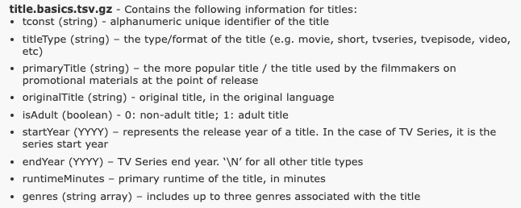

# Lesson 2

# _"No data is clean, but most is useful" - Dean Abbott_

# Basic checks on the data files

## Introduction

At this stage you have procured the data and you can _touch_ and _feel_ it. Like how a doctor's first tool is a stethoscope, this chapter introduces you to your tools to check the basics of the data.

## Sizing up the files

### How many lines?

`wc` - should be your first check; stands for word-count, but most of us use it for line count.

First change directory to where you have downloaded the files and uncompressed them.

```
cd imdb/raw
```

Why not check the line count of all the files?

```
wc -l *.tsv
```

- `wc` is the command
- `-l` option to output only lines
- `*.tsv` lists all files that matches the that ends with .tsv

You must see something like this:

```
11302644   name.basics.tsv
30496587   title.akas.tsv
8569812    title.basics.tsv
8569812    title.crew.tsv
6396466    title.episode.tsv
48175562   title.principals.tsv
1200998    title.ratings.tsv
```

Which is the largest and the smallest (well, by line count, of course)? Don't strain your eyes, let's sort the output with the files with highest line count first.

```
wc -l *.tsv | sort -n -r
```

what did we do? We passed the output of `wc` to `sort` - you see `|` is very powerful. Sort has two options:

- `-n` - tells the command to to numerical sorting
- `-r` - to sort in reverse order

You will now see an output like this:

```
48175562   title.principals.tsv
30496587   title.akas.tsv
11302644   name.basics.tsv
8569812    title.crew.tsv
8569812    title.basics.tsv
6396466    title.episode.tsv
1200998    title.ratings.tsv
```

That is about the lines, does the size have the same pattern? Let us use the file listing command `ls` for the purpose with the size being printed with human readable format.

```
ls -lShn *.tsv
```

- `-l` - prints the long format
- `-S` - prints the files sorted by size
- `-h` - human readable format - like 20M, 1K, 2.3G
- `-n` - open the manual for `ls` and find out :)

You will see an output like this:

```
-rw-r--r--  1 501  20   2.0G Jan  4 08:51 title.principals.tsv
-rw-r--r--  1 501  20   1.4G Jan  4 09:14 title.akas.tsv
-rw-r--r--  1 501  20   698M Jan  4 08:54 title.basics.tsv
-rw-r--r--  1 501  20   646M Jan  4 08:45 name.basics.tsv
-rw-r--r--  1 501  20   265M Jan  4 08:53 title.crew.tsv
-rw-r--r--  1 501  20   158M Jan  4 08:52 title.episode.tsv
-rw-r--r--  1 501  20    20M Jan  4 08:48 title.ratings.tsv
```

What inference can we make here?

- The largest file has 48 million lines and the smallest has 1 million lines, so we cannot just fire up an editor and understand easily
- Two files `title.crew.tsv` and `title.basics.tsv` has exactly same number of lines and so must be closely related
- The ordering by size and by lines are slightly different, where in the file `title.basics.tsv` ranks higher in size although by lines it is lower. That is an indication that the average length of the lines in the file is much higher

Anything else you can learn from this?

### How do the headers look?

We have been given the meta data [here](https://www.imdb.com/interfaces/), but don't trust blindly, lets check the files against the meta data.

Let us look at the file `title.basics.csv`, the document from IMDB has this



What is in the file?

```
head -1 title.basics.tsv | tr '\t' '\n'
```

prints this

```
tconst
titleType
primaryTitle
originalTitle
isAdult
startYear
endYear
runtimeMinutes
genres
```

which means the header in the file matches that of the meta data that we provided.

## The dip test

At this point we have checked for the headers, the total lines in each file and the size of the files. It is time for us to take a look at a piece of each file. When you shop for perfume, the sales person will help you to smell (with coffee beans in between perfumes of course!), same when you shop for same eatables, you will taste it. Let us now taste the data files we have downloaded.

We do this by three basic tasting (testing?) methods:

- Inspect the first 10 lines
- Inspect the last 10 lines
- Inspect random 10 lines

The document from the data provider should be the basis on which this exercise must be done; to remind you - open the [documentation](https://www.imdb.com/interfaces/) from IMDB on a separate browser tab. This documentation has two files that _seem_ to say about movie/tv-show tiles, `title.akas.tsv` and `title.basics.tsv`. Let's check them out.

Executing

```
head title.akas.tsv | column -t
```

---

**Commands used**

- `head`: spits out top 10 lines by default
- `column`: Feed the output of head to this command which will pretty print the otherwise not-so-nicely formatted content.

---

Result of the above command:

```
titleId    ordering  title           region  language  types        attributes  isOriginalTitle
tt0000001  1         Карменсіта      UA      \N        imdbDisplay  \N          0
tt0000001  2         Carmencita      DE      \N        \N           literal     title            0
tt0000001  3         Carmencita      -       spanyol   tánc         HU          \N               imdbDisplay  \N        0
tt0000001  4         Καρμενσίτα      GR      \N        imdbDisplay  \N          0
tt0000001  5         Карменсита      RU      \N        imdbDisplay  \N          0
tt0000001  6         Carmencita      US      \N        imdbDisplay  \N          0
tt0000001  7         Carmencita      \N      \N        original     \N          1
tt0000001  8         カルメンチータ  JP      ja        imdbDisplay  \N          0
tt0000002  1         Le              clown   et        ses          chiens      \N               \N          original \N  1
```

Now, let us checkout the last few lines .

```
tail  title.akas.tsv | column -t
```

---

**Commands used**

- `tail`: spits out last 10 lines by default
- `column`: Feed the output of tail to this command which will pretty print the otherwise not-so-nicely formatted content.

---

Result of the above command:

```
tt9916850  7  Folge       #3.19  DE  de  \N           \N  0
tt9916852  1  Episodio    #3.20  ES  es  \N           \N  0
tt9916852  2  Épisode     #3.20  FR  fr  \N           \N  0
tt9916852  3  Folge       #3.20  DE  de  \N           \N  0
tt9916852  4  エピソード  #3.20  JP  ja  \N           \N  0
tt9916852  5  Episódio    #3.20  PT  pt  \N           \N  0
tt9916852  6  Episodio    #3.20  IT  it  \N           \N  0
tt9916852  7  एपिसोड      #3.20  IN  hi  \N           \N  0
tt9916856  1  The         Wind   DE  \N  imdbDisplay  \N  0
tt9916856  2  The         Wind   \N  \N  original     \N  1
```

Now, let us check out _random_ 10 lines because first few and last few lines can be deceptive, no?

```
gshuf -n 10  title.akas.tsv | column -t
```

---

**Commands used**

- `gshuf`: spits out 'n' random lines from the file (shuf - for shuffle)
- `column`: Feed the output of `gshuf` to this command which will pretty print the otherwise not-so-nicely formatted content.

---

Result of the above command:

```
tt2342329   4   Ten       Little    Indians  PH       \N     \N        \N        0
tt4207718   2   एपिसोड    #1.6      IN       hi       \N     \N        0
tt6575414   2   Folge     vom       25.      April    2008   DE        de        \N           \N  0
tt15848482  3   Episodio  fechado   8        octubre  2016   ES        es        \N           \N  0
tt0078512   4   Xica      da        Silva    \N       \N     original  \N        1
tt0756094   6   Épisode   #1.8      FR       fr       \N     \N        0
tt7277250   6   Episodio  #1.6      ES       es       \N     \N        0
tt0187083   8   Liang     shan      guai     zhao     \N     \N        original  \N           1
tt11009206  3   Episodio  #1.508    IT       it       \N     \N        0
tt0110054   12  La        leggenda  del      drago    rosso  IT        \N        imdbDisplay  \N  0
```

You can try the above commands and what inferences can you make? I can make these from the 30 lines that we saw above:

- We can see some Hindi, Japanese? the titles are not just in ASCII format, they are in unicode as well
- The data is sparse, can you see a lot of '\N' - which means there is no data
- Looks like titles are repeating, like for example 'Carmencita' occurs several times
- There seems to be some sort of a unique identifier for the titles, which will be of use to us to relate to other files, perhaps?

Let us look at `title.basics.tsv` in the similar manner - head, tail and shuffled. For brevity, will be printing the header and shuffled output only here. But you must do the `head` and `tail`.

```
head -1 title.basics.tsv; gshuf -n 10 title.basics.tsv
```

---

**Commands used**

- `gshuf`: spits out 'n' random lines from the file (shuf - for shuffle)
- `head -1`: prints the first line of a file
- the `;` (semi-colon) above is not same as '|' we used previously. The semi-colon only means that the two commands are written on the same line and needs to be executed one after the other.

---

At this point is appears like `title.basics.tsv` and `title.akas.tsv` are similar, but not the same. So, it makes sense to check out your favorite movie in both these files to see what really is the difference between the two. Let us check out the movie [Kumbalangi Nights](https://en.wikipedia.org/wiki/Kumbalangi_Nights) (you must watch the movie if you haven't). A simple `grep` should do the work:

```
head -1 title.akas.tsv; grep "Kumbalangi Nights" title.akas.tsv; head -1 title.basics.tsv; grep "Kumbalangi Nights" title.basics.tsv
```

which spits out:

```
titleId	ordering	title	region	language	types	attributes	isOriginalTitle
tt8413338	10	Kumbalangi Nights	IT	\N	imdbDisplay	\N	0
tt8413338	11	Kumbalangi Nights	GB	\N	imdbDisplay	\N	0
tt8413338	1	Kumbalangi Nights	US	\N	imdbDisplay	\N	0
tt8413338	2	Kumbalangi Nights	IN	en	imdbDisplay	\N	0
tt8413338	4	Kumbalangi Nights	AU	\N	imdbDisplay	\N	0
tt8413338	5	Kumbalangi Nights	IE	en	imdbDisplay	\N	0
tt8413338	6	Kumbalangi Nights	NZ	en	imdbDisplay	\N	0
tt8413338	7	Kumbalangi Nights	IN	hi	imdbDisplay	\N	0
tt8413338	8	Kumbalangi Nights	CA	en	imdbDisplay	\N	0
tt8413338	9	Kumbalangi Nights	\N	\N	original	\N	1
tconst	titleType	primaryTitle	originalTitle	isAdult	startYear	endYear	runtimeMinutes	genres
tt8413338	movie	Kumbalangi Nights	Kumbalangi Nights	0	2019	\N	135	Comedy,Drama,Romance
```

You can try out a few other movies of your choice to draw your inferences. Some inferences:

- `title.basics.tsv` has one entry per show/movie with a unique identifier called tconst
- `title.akas.tsv` has the tconst from the previous file used to identify the variations of the ones in basics - like other languages and regions the same movie is available and a notation of which one of those is original.

---

Similarly checkout the other 5 data files with basic dip test:
`name.basics.tsv`, `title.episode.tsv`, `title.ratings.tsv`, `title.crew.tsv`, `title.principals.tsv`

---

## Review

What did you learn in this lesson? Not any different from what you do when you interview someone or data someone, making sure you understand.

- Dip test your data files
- Get the basic characteristics of the file

## When should you be alarmed about the data at this stage?

- Data does not match the documentation e.g. in IMDB data `title` is missing in the data file `title.akas.tsv.gz`
- Data size does not match your intuition e.g. `title.akas.tsv.gz` has just 1000 lines, meaning less than 1000 movies/shows - which indicates something is missing
- Repeated extract of random data (using `gshuf`) shows that data is not something you can comprehend

You can move on to qualitative assessment of the data in [Lesson 3](Lesson3.md).
